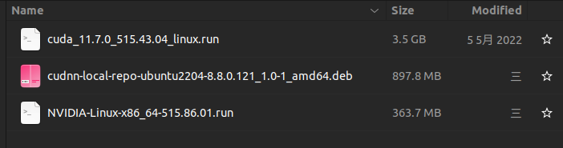

# Ubuntu软件安装

## 安装NVIDIA Driver, CUDAToolkit, cuDNN
### 安装前注意事项
1. 注意驱动和cuda的版本对应，会影响pytorch的gpu版本
2. 注意安装驱动时，不能显卡驱动显示，可能会出问题


参考安装 https://blog.csdn.net/Perfect886/article/details/119109380
```sh
# 1. 卸载nviida驱动
sudo apt-get remove --purge nvidia*

# 2. 卸载cuda
sudo apt-get remove --purge cuda*
sudo rm -rf /usr/local/cuda*

# 3. 查看本机显卡设备
lspci | grep -i nvidia
lspci |grep VGA

```

### 在线安装
```sh
# 选择合适的驱动版本
ubuntu-drivers devices

# apt安装
apt-get install nvidia-driver-515

```

### 本地安装
1. 下载.run驱动文件，文件如下 [下载地址](https://www.nvidia.com/en-us/drivers/unix/)
   
2. 正确执行安装前准备工作
3. 执行`init 3`, 让系统进入命令行桌面
4. 执行bash安装, 安装驱动，有弹框选择默认


